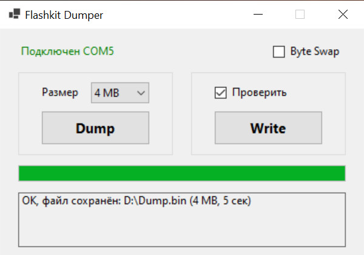
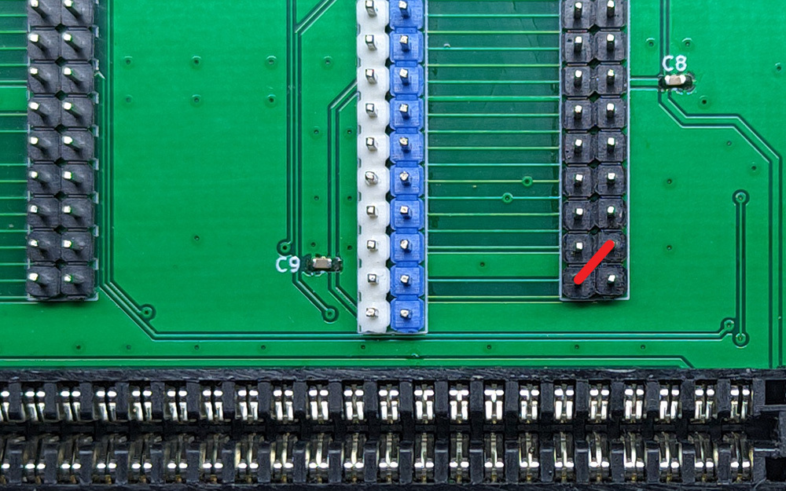

### Flashkit-Dumper
Приложение для дампера/программатора [Flashkit MD](https://github.com/JRBVZz/Flashkit-MD) позволяет читать NOR Flash размером до 1Gbit (128MB) и записывать до 256Mbit (32MB). Лимит объема для записи связан с ограничениями протокола устройства.  
  
Приложение не определяет объем памяти, сколько выберете в выпадающем списке, столько и прочитает.  
Для чтения и записи картриджей Sega MegaDrive есть чекбокс Byte Swap.

  
### Требования
* Установить [.NET 6.0 Runtime или SDK](https://dotnet.microsoft.com/ru-ru/download/dotnet/6.0)
* Для корректной работы на Flashkit MD нужно соединить сигнал CE_L (пин слота B17) с землёй (GND), если этого не сделать, то свыше 4MB в дампе будут только xFF. Для моего форка можно сделать съёмную перемычку, как показано на картинке ниже.  
  

